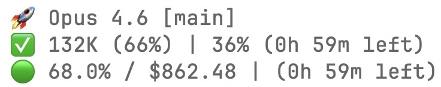

# claude-web-usage

[](https://www.apple.com/macos/)
[](https://nodejs.org/)
[](LICENSE)
[](#zero-dependencies)

**Reliable Claude Code usage monitoring via Claude Desktop's web session cookies.**

Bypass the OAuth API rate limiting problem that makes statusline usage tracking impossible when running multiple Claude Code sessions.

---

## The Problem

Claude Code's built-in usage polling calls `api.anthropic.com/api/oauth/usage` to show your rate limit status (5-hour block utilization, weekly usage). This works fine with **one** session.

But when you run **3-5+ concurrent sessions** (common for power users), every session shares the same OAuth token and each session's internal polling hammers the same rate limit bucket. The API responds with `429 Too Many Requests` and eventually stops returning data entirely. Your statusline goes blank:

```
🚀 Opus 4.6 [main]
✅ 102K (51%) | -% (-)           ← No block data
🟢 unavailable                   ← No weekly data
```

**There is no workaround within the OAuth API.** You cannot reduce polling frequency per-session because Claude Code controls its own internal polling. The rate limit is per-token, not per-IP, so all sessions compete for the same quota.

Related: [Claude Code #29604](https://github.com/anthropics/claude-code/issues/29604), [Claude Code #22264](https://github.com/anthropics/claude-code/issues/22264)

---

## The Solution

Use the **Claude Desktop app's web session cookies** to call a completely different API endpoint:

```
GET https://claude.ai/api/organizations/{orgId}/usage
```

This endpoint:
- Uses **web session cookies** for auth (not OAuth tokens)
- Has its own **separate rate limit bucket** (unaffected by Claude Code sessions)
- Returns the **same data** (5-hour block %, weekly %, reset times)
- Works reliably with **any number** of concurrent Claude Code sessions

The cookies are extracted and decrypted directly from Claude Desktop's local SQLite database. No browser extension, no proxy, no extra login needed.

---

## Status Bar Output

The script produces a 3-line status bar in Claude Code:

```
🚀 Opus 4.6 [main]
✅ 102K (51%) | 28% (1h 34m left)
🟢 67.0% / $852.30 | (5d 18h 26m left)
```

| Line | Content | Source |
|------|---------|--------|
| **Line 1** | Model name + git branch | Claude Code session JSON + `git rev-parse` |
| **Line 2** | Context window (tokens, %) \| 5-hour block (%, countdown) | Session JSON + Web API |
| **Line 3** | Weekly utilization (%) / cost ($) \| weekly reset countdown | Web API + ccusage CLI |

### Reading the status bar

- **`102K (51%)`** — You've used 102,000 tokens, which is 51% of your 200K context window
- **`28% (1h 34m left)`** — You've used 28% of your 5-hour rate limit block; it resets in 1h 34m
- **`67.0%`** — You've used 67% of your weekly rate limit
- **`$852.30`** — Your estimated cost this week (requires [ccusage](https://github.com/ryoppippi/ccusage))
- **`(5d 18h 26m left)`** — Your weekly rate limit resets in ~6 days

---

## Requirements

| Requirement | Notes |
|-------------|-------|
| **macOS** | Required for Keychain access and Chromium cookie decryption |
| **Node.js >= 18** | Uses built-in `crypto`, `https`, `fs` modules only |
| **Claude Desktop app** | Must be installed and logged in to claude.ai |
| **Claude Code** | The CLI that displays the statusline |
| **ccusage** (optional) | For weekly cost tracking — `npm install -g ccusage` |

---

## Installation

### npm (recommended)

```bash
npm install -g claude-web-usage
```

Then add to your `~/.claude/settings.json`:

```json
{
  "statusLine": {
    "command": "claude-web-usage"
  }
}
```

Restart or resume your Claude Code sessions. That's it.

### From source

```bash
git clone https://github.com/skibidiskib/claude-web-usage.git
cd claude-web-usage
bash install.sh
```

The installer will:
1. Check all prerequisites (macOS, Node.js, Claude Desktop, sqlite3)
2. Copy scripts to `~/.claude/`
3. Configure `~/.claude/settings.json` (with backup)
4. Test cookie decryption
5. Test the web API call
6. Show a summary

### Debug tools

After installing via npm, the debug tools are available at:

```bash
# Test cookie decryption
npx claude-web-usage --test-cookies
# Or run directly from the install location:
node $(npm root -g)/claude-web-usage/debug-cookies.js

# Test web API call
node $(npm root -g)/claude-web-usage/web-usage-fetch.js
```

---

## Configuration

### settings.json

The only configuration needed is in `~/.claude/settings.json`:

```json
{
  "statusLine": {
    "command": "claude-web-usage"
  }
}
```

> **Tip:** If the command isn't found, use the full path: `node $(npm root -g)/claude-web-usage/combined-statusline.js`

### Cache settings

These are configurable constants at the top of `combined-statusline.js`:

| Constant | Default | Description |
|----------|---------|-------------|
| `CACHE_MAX_AGE` | `30` | Seconds before the cached API response expires |
| `LOCK_MAX_AGE` | `15` | Seconds before the lock file is considered stale |

The cache file (`~/.cache/ccstatusline-api.json`) is compatible with the [ccstatusline-usage](https://www.npmjs.com/package/ccstatusline-usage) npm package.

### Weekly cost tracking

To enable the weekly cost display (`$852.30` in the status bar), install [ccusage](https://github.com/ryoppippi/ccusage):

```bash
npm install -g ccusage
```

The cost is calculated in a background process and cached for 5 minutes.

---

## Architecture

```
┌──────────────────────────────────────────────────────────────────────────┐
│                          Claude Code Session                            │
│                                                                         │
│  Session JSON ──→ combined-statusline.js ──→ 3-line status output      │
│  (stdin)            │                                                    │
│                     │                                                    │
│                     ├──→ Context window info (from session JSON)         │
│                     ├──→ Git branch (from git rev-parse)                │
│                     │                                                    │
│                     ├──→ Cookie Decryption                               │
│                     │     │                                              │
│                     │     ├─ Keychain: "Claude Safe Storage" password    │
│                     │     ├─ PBKDF2(password, "saltysalt", 1003, SHA1)  │
│                     │     ├─ SQLite: ~/Library/.../Claude/Cookies        │
│                     │     └─ AES-128-CBC decrypt, strip 32-byte prefix  │
│                     │                                                    │
│                     ├──→ Web API (in-process HTTPS)                      │
│                     │     │                                              │
│                     │     └─ GET claude.ai/api/organizations/{org}/usage │
│                     │        Cookie: sessionKey=...; lastActiveOrg=...   │
│                     │                                                    │
│                     ├──→ File Cache                                      │
│                     │     ├─ ~/.cache/ccstatusline-api.json (30s TTL)   │
│                     │     └─ ~/.cache/ccstatusline-api.lock (15s)       │
│                     │                                                    │
│                     └──→ Weekly Cost (background spawn)                  │
│                           └─ ccusage daily -s YYYYMMDD -u YYYYMMDD -j   │
└──────────────────────────────────────────────────────────────────────────┘
```

### Data flow

1. **Claude Code** pipes session JSON to stdin (model info, context window stats)
2. **combined-statusline.js** reads the JSON and extracts model + context data
3. **Cookie decryption** retrieves the web session from Claude Desktop's encrypted cookie store
4. **In-process HTTPS** calls the claude.ai usage API (must be in-process — see Cloudflare note below)
5. **File cache** prevents redundant API calls across multiple sessions (30-second TTL)
6. **Lock file** prevents parallel API calls when multiple sessions refresh simultaneously
7. **Background ccusage** spawns a detached process to calculate weekly cost (cached 5 minutes)
8. **Output** is the formatted 3-line string that Claude Code displays in the status bar

---

## How Cookie Decryption Works

Claude Desktop is an Electron app, which uses Chromium under the hood. Chromium encrypts cookies before storing them in a SQLite database. On macOS, the encryption key is derived from the macOS Keychain.

### Step-by-step process

```
                macOS Keychain
                      │
                      ▼
    ┌─────────────────────────────────┐
    │ security find-generic-password  │
    │ -s "Claude Safe Storage" -w     │
    │                                 │
    │ Returns: base64 password string │
    └─────────────┬───────────────────┘
                  │
                  ▼
    ┌─────────────────────────────────┐
    │ PBKDF2 Key Derivation           │
    │                                 │
    │ Password: (from Keychain)       │
    │ Salt:     "saltysalt"           │
    │ Iterations: 1003               │
    │ Key length: 16 bytes           │
    │ Hash: SHA-1                    │
    │                                 │
    │ Output: AES-128 key             │
    └─────────────┬───────────────────┘
                  │
                  ▼
    ┌─────────────────────────────────┐
    │ SQLite Cookie Database          │
    │                                 │
    │ Path: ~/Library/Application     │
    │       Support/Claude/Cookies    │
    │                                 │
    │ SELECT hex(encrypted_value)     │
    │ FROM cookies                    │
    │ WHERE host_key = '.claude.ai'   │
    │   AND name = 'sessionKey'       │
    └─────────────┬───────────────────┘
                  │
                  ▼
    ┌─────────────────────────────────┐
    │ AES-128-CBC Decryption          │
    │                                 │
    │ Encrypted: [v10][ciphertext]    │
    │ Strip "v10" prefix (3 bytes)    │
    │ IV: 16 bytes of 0x20 (spaces)  │
    │ Key: (from PBKDF2 above)       │
    │                                 │
    │ Decrypted: [32-byte prefix]     │
    │            [actual cookie value]│
    └─────────────┬───────────────────┘
                  │
                  ▼
    ┌─────────────────────────────────┐
    │ Strip 32-byte binary prefix     │
    │                                 │
    │ Critical discovery: Chromium    │
    │ prepends a 32-byte nonce/hash   │
    │ before the actual cookie value. │
    │                                 │
    │ Result: sk-ant-sid01-...        │
    └─────────────────────────────────┘
```

### The three cookies

| Cookie | Purpose | Example value |
|--------|---------|---------------|
| `sessionKey` | Auth session token | `sk-ant-sid01-...` |
| `lastActiveOrg` | Organization UUID | `a1b2c3d4-e5f6-...` |
| `cf_clearance` | Cloudflare clearance | (opaque token) |

---

## Cloudflare Gotcha

The HTTPS request to `claude.ai` **must** be made **in-process** using Node.js `https.request()`.

If you spawn a child process (e.g., `execSync('curl ...')` or `spawnSync('node', ['-e', '...'])`) to make the request, Cloudflare will return **403 Forbidden** even with a valid `cf_clearance` cookie.

This is because Cloudflare's bot detection compares TLS fingerprints. A child process creates a new TLS connection with a different fingerprint than the one that originally received the `cf_clearance` cookie, so Cloudflare rejects it.

**Bottom line:** The web API call must happen in the same Node.js process that outputs the statusline. This is why `combined-statusline.js` makes the HTTPS request directly rather than shelling out.

---

## OAuth API vs Web API

| Aspect | OAuth API | Web API (this tool) |
|--------|-----------|---------------------|
| **Endpoint** | `api.anthropic.com/api/oauth/usage` | `claude.ai/api/organizations/{org}/usage` |
| **Auth** | OAuth Bearer token | Web session cookies |
| **Rate limit bucket** | Shared with all Claude Code sessions | Separate (web session) |
| **Multi-session** | Breaks at 3-5+ sessions | Works with any number |
| **Data returned** | Block %, weekly % | Block %, weekly %, reset times, per-model breakdown |
| **Dependencies** | Claude Code internal | Claude Desktop app cookies |
| **Cookie decryption** | Not needed | Required (macOS Keychain + AES) |
| **Cloudflare** | Not applicable | Must use in-process HTTPS |
| **Reliability** | Degrades with sessions | Consistently reliable |

---

## API Response Format

`GET https://claude.ai/api/organizations/{orgId}/usage`

```json
{
  "five_hour": {
    "utilization": 28,
    "resets_at": "2026-03-06T03:00:00.577989+00:00"
  },
  "seven_day": {
    "utilization": 67,
    "resets_at": "2026-03-06T03:00:00.578009+00:00"
  },
  "seven_day_oauth_apps": null,
  "seven_day_opus": null,
  "seven_day_sonnet": {
    "utilization": 5,
    "resets_at": "2026-03-06T05:00:00.578016+00:00"
  },
  "seven_day_cowork": null,
  "extra_usage": {
    "is_enabled": false,
    "monthly_limit": null,
    "used_credits": null,
    "utilization": null
  }
}
```

| Field | Description |
|-------|-------------|
| `five_hour.utilization` | Current 5-hour rate limit block usage (0-100%) |
| `five_hour.resets_at` | ISO timestamp when the 5-hour block resets |
| `seven_day.utilization` | Current 7-day rolling usage (0-100%) |
| `seven_day.resets_at` | ISO timestamp when the weekly window resets |
| `seven_day_sonnet` | Separate Sonnet model usage (if applicable) |
| `seven_day_opus` | Separate Opus model usage (if applicable) |
| `extra_usage` | Extra usage/overuse billing info |

---

## File Reference

| File | Purpose | Where it runs |
|------|---------|---------------|
| `combined-statusline.js` | Main statusline script for Claude Code | `~/.claude/` |
| `web-usage-fetch.js` | Standalone debug tool — fetches usage with verbose output | Anywhere |
| `debug-cookies.js` | Cookie decryption debugger — shows raw hex bytes | Anywhere |
| `install.sh` | Non-destructive installer | Repo directory |

---

## Debug Tools

### Test cookie decryption

```bash
node debug-cookies.js
```

Shows raw hex bytes, decrypted lengths, ASCII offsets, and final cookie values for `sessionKey`, `lastActiveOrg`, and `cf_clearance`.

### Test web API

```bash
node web-usage-fetch.js
```

Makes verbose API calls with diagnostic output on stderr and JSON result on stdout. Tests multiple endpoints (`/rate_limits`, `/usage`, `/settings`).

### Check cached data

```bash
cat ~/.cache/ccstatusline-api.json | python3 -m json.tool
```

### Clear cache

```bash
rm -f ~/.cache/ccstatusline-api.json ~/.cache/ccstatusline-api.lock
```

---

## Zero Dependencies

All scripts use **only Node.js built-in modules**:

- `crypto` — PBKDF2 key derivation + AES decryption
- `child_process` — Keychain access (`security`), SQLite queries (`sqlite3`), git branch
- `https` — Web API calls
- `fs` — File cache read/write
- `path` — Path resolution
- `os` — Home directory

No `package.json`. No `npm install`. No `node_modules/`.

---

## Compatible Tools

| Tool | Compatibility | Notes |
|------|--------------|-------|
| [ccstatusline-usage](https://www.npmjs.com/package/ccstatusline-usage) | Cache-compatible | Reads from / writes to the same `~/.cache/ccstatusline-api.json` format |
| [ccusage](https://github.com/ryoppippi/ccusage) | Optional integration | Weekly cost tracking via background spawn |
| [Claude Code](https://claude.ai/claude-code) | Required | Consumes the statusline output |
| [Claude Desktop](https://claude.ai/download) | Required | Source of web session cookies |

---

## FAQ

### Does this require me to keep Claude Desktop open?

You need to have **logged in** to Claude Desktop at least once (so the cookies exist in the database). The app does not need to be actively running for the cookies to be read, but sessions do expire — if you haven't opened Claude Desktop in a while, the `sessionKey` may be stale and you'll need to open it and log in again.

### Will this break if Anthropic changes the API?

The script handles multiple response formats and falls back gracefully. If the API changes, you'll see `-` for usage values but the statusline won't crash or error out. The `web-usage-fetch.js` debug tool tries multiple endpoints to help diagnose.

### Does this work on Linux or Windows?

**Not currently.** The cookie decryption is macOS-specific:
- macOS uses the Keychain (`security find-generic-password`)
- Linux Chromium uses `gnome-keyring` or `kwallet` with a different key derivation
- Windows uses DPAPI

Pull requests for Linux/Windows support are welcome. The main changes needed are in `getEncKey()` and the cookie database path.

### Is this safe? Does it send my cookies anywhere?

The cookies are only used to make HTTPS requests directly to `claude.ai` (Anthropic's own server). They are never logged, stored in plain text, or sent anywhere else. The cache file (`~/.cache/ccstatusline-api.json`) stores only the usage percentages and reset timestamps, not any cookies or tokens.

### Can I use this without Claude Code?

The `web-usage-fetch.js` script works standalone — it fetches usage data and outputs JSON. You could use it in any custom script or integration. The `combined-statusline.js` script specifically expects Claude Code's session JSON on stdin.

### How often does it call the API?

At most once every 30 seconds (controlled by `CACHE_MAX_AGE`). The lock file prevents multiple sessions from calling simultaneously. In practice, with 5 sessions, the API is called about twice per minute total, not 5 times.

### What if my session expires?

The script falls back to stale cached data. You'll see the last-known values until you open Claude Desktop and the session refreshes. Check `TROUBLESHOOTING.md` for details.

### Does this conflict with Claude Code's built-in usage polling?

No. Claude Code's internal polling uses the OAuth API, and this tool uses the web API. They are completely independent. This tool's statusline **replaces** the built-in display (via `settings.json`), but the underlying OAuth polling continues in the background without conflict.

---

## Troubleshooting

See [TROUBLESHOOTING.md](TROUBLESHOOTING.md) for a detailed guide covering:

- Cookie decryption failures
- Cloudflare 403 errors
- Claude Desktop not running / session expired
- Database locked errors
- Cache issues
- Comparison with OAuth rate limiting symptoms

---

## Contributing

Contributions are welcome! Areas where help is especially appreciated:

- **Linux support** — Implement `gnome-keyring` / `kwallet` cookie decryption
- **Windows support** — Implement DPAPI cookie decryption
- **Additional API endpoints** — If you discover other useful claude.ai endpoints
- **Better error messages** — More helpful diagnostics for common failures

### Development

```bash
# Clone the repo
git clone https://github.com/skibidiskib/claude-web-usage.git
cd claude-web-usage

# Test cookie decryption
node debug-cookies.js

# Test API call
node web-usage-fetch.js

# Test the full statusline (pipe mock session JSON)
echo '{"model":{"display_name":"Opus 4.6"},"context_window":{"used_percentage":51,"context_window_size":200000}}' | node combined-statusline.js
```

---

## Screenshots

Claude Code status bar showing real-time usage data from the web API:



---

## License

[MIT](LICENSE)
