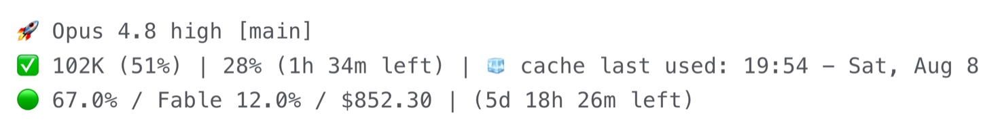

# claude-web-usage

[](https://www.apple.com/macos/)
[](https://nodejs.org/)
[](LICENSE)
[](#zero-dependencies)

**Reliable Claude Code usage monitoring via Claude Desktop's web session cookies.**

Bypass the OAuth API rate limiting problem that makes statusline usage tracking impossible when running multiple Claude Code sessions.

---

## The Problem

Claude Code's built-in usage polling calls `api.anthropic.com/api/oauth/usage` to show your rate limit status (5-hour block utilization, weekly usage). This works fine with **one** session.

But when you run **3-5+ concurrent sessions** (common for power users), every session shares the same OAuth token and each session's internal polling hammers the same rate limit bucket. The API responds with `429 Too Many Requests` and eventually stops returning data entirely. Your statusline goes blank:

```
🚀 Opus 4.6 [main]
✅ 102K (51%) | -% (-)           ← No block data
🟢 unavailable                   ← No weekly data
```

**There is no workaround within the OAuth API.** You cannot reduce polling frequency per-session because Claude Code controls its own internal polling. The rate limit is per-token, not per-IP, so all sessions compete for the same quota.

Related: [Claude Code #29604](https://github.com/anthropics/claude-code/issues/29604), [Claude Code #22264](https://github.com/anthropics/claude-code/issues/22264)

---

## The Solution

Use the **Claude Desktop app's web session cookies** to call a completely different API endpoint:

```
GET https://claude.ai/api/organizations/{orgId}/usage
```

This endpoint:
- Uses **web session cookies** for auth (not OAuth tokens)
- Has its own **separate rate limit bucket** (unaffected by Claude Code sessions)
- Returns the **same data** (5-hour block %, weekly %, reset times)
- Works reliably with **any number** of concurrent Claude Code sessions

The cookies are extracted and decrypted directly from Claude Desktop's local SQLite database. No browser extension, no proxy, no extra login needed.

---

## Status Bar Output

The script produces a 3-line status bar in Claude Code:

```
🚀 Opus 4.8 high [main]
✅ 102K (51%) | 28% (1h 34m left) | 🧊 cache last used: 19:54
🟢 67.0% / Fable 12.0% / $852.30 | (5d 18h 26m left)
```

| Line | Content | Source |
|------|---------|--------|
| **Line 1** | Model name + reasoning effort + git branch | Claude Code session JSON + `git rev-parse` |
| **Line 2** | Context window (tokens, %) \| 5-hour block (%, countdown) \| prompt-cache last touched | Session JSON + Web API + session transcript |
| **Line 3** | Weekly utilization (%) / per-model window (%) / cost ($) \| weekly reset countdown | Web API + ccusage CLI |

### Reading the status bar

- **`Opus 4.8 high`** — Active model and reasoning effort (`low`/`medium`/`high`/`xhigh`/`max`)
- **`102K (51%)`** — You've used 102,000 tokens, which is 51% of your 200K context window
- **`28% (1h 34m left)`** — You've used 28% of your 5-hour rate limit block; it resets in 1h 34m
- **`🧊 cache last used: 19:54`** — The last time this session touched its prompt cache. 🧊 = the cached prefix is still inside its TTL, so the next turn re-uses it; 💧 = the window lapsed and the next turn re-caches at full price. See [Prompt-cache freshness](#prompt-cache-freshness)
- **`67.0%`** — You've used 67% of your weekly rate limit (all models)
- **`Fable 12.0%`** — You've used 12% of the separate weekly window Anthropic scopes to Fable. Hidden when your account has no model-scoped limit
- **`$852.30`** — Your estimated cost this week (requires [ccusage](https://github.com/ryoppippi/ccusage))
- **`(5d 18h 26m left)`** — Your weekly rate limit resets in ~6 days

---

## Prompt-cache freshness

Claude Code caches your conversation prefix so repeat turns are billed at a fraction of the input rate. That cache has a TTL (currently 1 hour for most sessions, 5 minutes in some), and the TTL **restarts every time the cache is used** — read or write. Knowing when it was last touched tells you whether your next message rides the cache or pays to rebuild it.

**No API reports this.** `claude.ai/api/organizations/{org}/usage` returns rate-limit windows only, and Claude Code's statusline payload carries model/context/cost but nothing about cache state. So it is derived locally, with zero extra network calls:

1. Claude Code passes `transcript_path` in the statusline JSON — the current session's `.jsonl`.
2. The script reads the **last 256 KB** of that file (transcripts reach tens of MB; only the tail matters) via a positioned read.
3. Scanning backwards, it takes the most recent record whose `message.usage` shows a non-zero `cache_read_input_tokens` or `cache_creation_input_tokens`. That record's `timestamp` is the last cache touch.
4. The TTL comes from the same records: `usage.cache_creation.ephemeral_1h_input_tokens` vs `ephemeral_5m_input_tokens`. It is read, never assumed — a session dropped to the 5-minute TTL is not mislabelled as warm for an hour.

Two deliberate details:

- **Sidechain records are skipped.** Subagent turns are written to the same transcript but cache a different prefix, so counting one would report a refresh that never happened for the main thread.
- **File mtime is never used.** Sessions still open in a terminal tab get their `.jsonl` touched roughly hourly with zero bytes written, so mtime reports activity that did not occur. Only a real record with a `timestamp` is trusted.

If the tail contains no cache-bearing record (a brand-new session), the segment is omitted entirely rather than guessed.

---

## Requirements

| Requirement | Notes |
|-------------|-------|
| **macOS** | Required for Keychain access and Chromium cookie decryption |
| **Node.js >= 18** | Uses built-in `crypto`, `https`, `fs` modules only |
| **Claude Desktop app** | Must be installed and logged in to claude.ai |
| **Claude Code** | The CLI that displays the statusline |
| **ccusage** (optional) | For weekly cost tracking — `npm install -g ccusage` |

---

## Installation

### npm (recommended)

```bash
npm install -g claude-web-usage
```

Then add to your `~/.claude/settings.json`:

```json
{
  "statusLine": {
    "command": "claude-web-usage"
  }
}
```

Restart or resume your Claude Code sessions. That's it.

### From source

```bash
git clone https://github.com/skibidiskib/claude-web-usage.git
cd claude-web-usage
bash install.sh
```

The installer will:
1. Check all prerequisites (macOS, Node.js, Claude Desktop, sqlite3)
2. Copy scripts to `~/.claude/`
3. Configure `~/.claude/settings.json` (with backup)
4. Test cookie decryption
5. Test the web API call
6. Show a summary

### Debug tools

After installing via npm, the debug tools are available at:

```bash
# Test cookie decryption
npx claude-web-usage --test-cookies
# Or run directly from the install location:
node $(npm root -g)/claude-web-usage/debug-cookies.js

# Test web API call
node $(npm root -g)/claude-web-usage/web-usage-fetch.js
```

---

## Configuration

### settings.json

The only configuration needed is in `~/.claude/settings.json`:

```json
{
  "statusLine": {
    "command": "claude-web-usage"
  }
}
```

> **Tip:** If the command isn't found, use the full path: `node $(npm root -g)/claude-web-usage/combined-statusline.js`

### Cache settings

These are configurable constants at the top of `combined-statusline.js`:

| Constant | Default | Description |
|----------|---------|-------------|
| `CACHE_MAX_AGE` | `30` | Seconds before the cached API response expires |
| `LOCK_MAX_AGE` | `15` | Seconds before the lock file is considered stale |
| `STALE_THRESHOLD` | `300` | Seconds after which cached data is flagged stale (🟡 instead of 🟢 on line 3) |
| `CACHE_TAIL_BYTES` | `262144` | Bytes read from the end of the session transcript to find the last prompt-cache touch |

The cache file (`~/.cache/ccstatusline-api.json`) is compatible with the [ccstatusline-usage](https://www.npmjs.com/package/ccstatusline-usage) npm package.

### Weekly cost tracking

To enable the weekly cost display (`$852.30` in the status bar), install [ccusage](https://github.com/ryoppippi/ccusage):

```bash
npm install -g ccusage
```

The cost is calculated in a background process and cached for 5 minutes.

Costs are summed from `ccusage blocks -j`, counting every 5-hour billing block whose **start** falls on or after the current weekly reset instant. The reset instant is derived from the API's own `seven_day.resets_at` (minus 7 days), so the `$` figure covers exactly the same window as the `%` figure. Earlier versions used `ccusage daily`, which filters by calendar date only and therefore counted the entire reset day — including the hours that belonged to the *previous* week.

> A block straddling the reset instant is attributed to the window it started in. That is a bounded, at-most-one-block discrepancy in the first hours after a reset.

---

## Architecture

```
┌──────────────────────────────────────────────────────────────────────────┐
│                          Claude Code Session                            │
│                                                                         │
│  Session JSON ──→ combined-statusline.js ──→ 3-line status output      │
│  (stdin)            │                                                    │
│                     │                                                    │
│                     ├──→ Context window info (from session JSON)         │
│                     ├──→ Git branch (from git rev-parse)                │
│                     │                                                    │
│                     ├──→ Prompt-cache freshness                          │
│                     │     └─ tail 256KB of transcript_path → last        │
│                     │        usage record + ephemeral TTL                │
│                     │                                                    │
│                     ├──→ Cookie Decryption                               │
│                     │     │                                              │
│                     │     ├─ Keychain: "Claude Safe Storage" password    │
│                     │     ├─ PBKDF2(password, "saltysalt", 1003, SHA1)  │
│                     │     ├─ SQLite: ~/Library/.../Claude/Cookies        │
│                     │     └─ AES-128-CBC decrypt, strip 32-byte prefix  │
│                     │                                                    │
│                     ├──→ Web API (in-process HTTPS)                      │
│                     │     │                                              │
│                     │     └─ GET claude.ai/api/organizations/{org}/usage │
│                     │        Cookie: sessionKey=...; lastActiveOrg=...   │
│                     │                                                    │
│                     ├──→ File Cache                                      │
│                     │     ├─ ~/.cache/ccstatusline-api.json (30s TTL)   │
│                     │     └─ ~/.cache/ccstatusline-api.lock (15s)       │
│                     │                                                    │
│                     └──→ Weekly Cost (background spawn)                  │
│                           └─ ccusage blocks -j, summed from reset instant│
└──────────────────────────────────────────────────────────────────────────┘
```

### Data flow

1. **Claude Code** pipes session JSON to stdin (model info, context window stats)
2. **combined-statusline.js** reads the JSON and extracts model + context data
3. **Cookie decryption** retrieves the web session from Claude Desktop's encrypted cookie store
4. **In-process HTTPS** calls the claude.ai usage API (must be in-process — see Cloudflare note below)
5. **File cache** prevents redundant API calls across multiple sessions (30-second TTL)
6. **Lock file** prevents parallel API calls when multiple sessions refresh simultaneously
7. **Transcript tail** is read from `transcript_path` to find the last prompt-cache touch and its TTL (local file read, no network)
8. **Background ccusage** spawns a detached process to calculate weekly cost (cached 5 minutes)
9. **Output** is the formatted 3-line string that Claude Code displays in the status bar

---

## How Cookie Decryption Works

Claude Desktop is an Electron app, which uses Chromium under the hood. Chromium encrypts cookies before storing them in a SQLite database. On macOS, the encryption key is derived from the macOS Keychain.

### Step-by-step process

```
                macOS Keychain
                      │
                      ▼
    ┌─────────────────────────────────┐
    │ security find-generic-password  │
    │ -s "Claude Safe Storage" -w     │
    │                                 │
    │ Returns: base64 password string │
    └─────────────┬───────────────────┘
                  │
                  ▼
    ┌─────────────────────────────────┐
    │ PBKDF2 Key Derivation           │
    │                                 │
    │ Password: (from Keychain)       │
    │ Salt:     "saltysalt"           │
    │ Iterations: 1003               │
    │ Key length: 16 bytes           │
    │ Hash: SHA-1                    │
    │                                 │
    │ Output: AES-128 key             │
    └─────────────┬───────────────────┘
                  │
                  ▼
    ┌─────────────────────────────────┐
    │ SQLite Cookie Database          │
    │                                 │
    │ Path: ~/Library/Application     │
    │       Support/Claude/Cookies    │
    │                                 │
    │ SELECT hex(encrypted_value)     │
    │ FROM cookies                    │
    │ WHERE host_key = '.claude.ai'   │
    │   AND name = 'sessionKey'       │
    └─────────────┬───────────────────┘
                  │
                  ▼
    ┌─────────────────────────────────┐
    │ AES-128-CBC Decryption          │
    │                                 │
    │ Encrypted: [v10][ciphertext]    │
    │ Strip "v10" prefix (3 bytes)    │
    │ IV: 16 bytes of 0x20 (spaces)  │
    │ Key: (from PBKDF2 above)       │
    │                                 │
    │ Decrypted: [32-byte prefix]     │
    │            [actual cookie value]│
    └─────────────┬───────────────────┘
                  │
                  ▼
    ┌─────────────────────────────────┐
    │ Strip 32-byte binary prefix     │
    │                                 │
    │ Critical discovery: Chromium    │
    │ prepends a 32-byte nonce/hash   │
    │ before the actual cookie value. │
    │                                 │
    │ Result: sk-ant-sid01-...        │
    └─────────────────────────────────┘
```

### The three cookies

| Cookie | Purpose | Example value |
|--------|---------|---------------|
| `sessionKey` | Auth session token | `sk-ant-sid01-...` |
| `lastActiveOrg` | Organization UUID | `a1b2c3d4-e5f6-...` |
| `cf_clearance` | Cloudflare clearance | (opaque token) |

---

## Cloudflare Gotcha

The HTTPS request to `claude.ai` **must** be made **in-process** using Node.js `https.request()`.

If you spawn a child process (e.g., `execSync('curl ...')` or `spawnSync('node', ['-e', '...'])`) to make the request, Cloudflare will return **403 Forbidden** even with a valid `cf_clearance` cookie.

This is because Cloudflare's bot detection compares TLS fingerprints. A child process creates a new TLS connection with a different fingerprint than the one that originally received the `cf_clearance` cookie, so Cloudflare rejects it.

**Bottom line:** The web API call must happen in the same Node.js process that outputs the statusline. This is why `combined-statusline.js` makes the HTTPS request directly rather than shelling out.

---

## OAuth API vs Web API

| Aspect | OAuth API | Web API (this tool) |
|--------|-----------|---------------------|
| **Endpoint** | `api.anthropic.com/api/oauth/usage` | `claude.ai/api/organizations/{org}/usage` |
| **Auth** | OAuth Bearer token | Web session cookies |
| **Rate limit bucket** | Shared with all Claude Code sessions | Separate (web session) |
| **Multi-session** | Breaks at 3-5+ sessions | Works with any number |
| **Data returned** | Block %, weekly % | Block %, weekly %, reset times, per-model breakdown |
| **Dependencies** | Claude Code internal | Claude Desktop app cookies |
| **Cookie decryption** | Not needed | Required (macOS Keychain + AES) |
| **Cloudflare** | Not applicable | Must use in-process HTTPS |
| **Reliability** | Degrades with sessions | Consistently reliable |

---

## API Response Format

`GET https://claude.ai/api/organizations/{orgId}/usage`

```json
{
  "five_hour": {
    "utilization": 28,
    "resets_at": "2026-03-06T03:00:00.577989+00:00",
    "limit_dollars": 0,
    "used_dollars": 0,
    "remaining_dollars": 0
  },
  "seven_day": {
    "utilization": 67,
    "resets_at": "2026-03-06T03:00:00.578009+00:00"
  },
  "seven_day_oauth_apps": null,
  "seven_day_opus": null,
  "seven_day_sonnet": {
    "utilization": 5,
    "resets_at": "2026-03-06T05:00:00.578016+00:00"
  },
  "seven_day_cowork": null,
  "extra_usage": {
    "is_enabled": false,
    "monthly_limit": null,
    "used_credits": null,
    "utilization": null
  },
  "limits": [
    { "kind": "session",       "group": "session", "percent": 28, "severity": "...", "resets_at": "...", "scope": null, "is_active": true },
    { "kind": "weekly_all",    "group": "weekly",  "percent": 67, "severity": "...", "resets_at": "...", "scope": null, "is_active": true },
    { "kind": "weekly_scoped", "group": "weekly",  "percent": 12, "severity": "...", "resets_at": "...", "is_active": true,
      "scope": { "model": { "id": null, "display_name": "Fable" }, "surface": null } }
  ]
}
```

| Field | Description |
|-------|-------------|
| `five_hour.utilization` | Current 5-hour rate limit block usage (0-100%) |
| `five_hour.resets_at` | ISO timestamp when the 5-hour block resets |
| `seven_day.utilization` | Current 7-day rolling usage (0-100%) |
| `seven_day.resets_at` | ISO timestamp when the weekly window resets |
| `seven_day_sonnet` | Separate Sonnet model usage (usually `null`) |
| `seven_day_opus` | Separate Opus model usage (usually `null`) |
| `extra_usage` | Extra usage/overuse billing info |
| `limits[]` | Flat list of every active window, including per-model ones |

### Per-model windows (`limits[]`)

The `seven_day_*` keys are legacy and are `null` on most accounts. The live per-model numbers arrive in the `limits[]` array instead:

- `kind: "session"` — mirrors `five_hour`
- `kind: "weekly_all"` — mirrors `seven_day`
- `kind: "weekly_scoped"` — a model-specific weekly window, identified by `scope.model.display_name` (e.g. `"Fable"`)

`percent` is already on a 0-100 scale, the same as `utilization`. This script reads the `weekly_scoped` entry whose `scope.model.display_name` matches `/fable/i` and renders it as `Fable x.x%`.

> ⚠️ `limits[]` is undocumented and unversioned. If Anthropic renames or drops it, the `Fable` segment simply disappears from the status bar — nothing else breaks.

---

## File Reference

| File | Purpose | Where it runs |
|------|---------|---------------|
| `combined-statusline.js` | Main statusline script for Claude Code | `~/.claude/` |
| `web-usage-fetch.js` | Standalone debug tool — fetches usage with verbose output | Anywhere |
| `debug-cookies.js` | Cookie decryption debugger — shows raw hex bytes | Anywhere |
| `install.sh` | Non-destructive installer | Repo directory |

---

## Debug Tools

### Test cookie decryption

```bash
node debug-cookies.js
```

Shows raw hex bytes, decrypted lengths, ASCII offsets, and final cookie values for `sessionKey`, `lastActiveOrg`, and `cf_clearance`.

### Test web API

```bash
node web-usage-fetch.js
```

Makes verbose API calls with diagnostic output on stderr and JSON result on stdout. Tests multiple endpoints (`/rate_limits`, `/usage`, `/settings`).

### Check cached data

```bash
cat ~/.cache/ccstatusline-api.json | python3 -m json.tool
```

### Clear cache

```bash
rm -f ~/.cache/ccstatusline-api.json ~/.cache/ccstatusline-api.lock
```

---

## Zero Dependencies

All scripts use **only Node.js built-in modules**:

- `crypto` — PBKDF2 key derivation + AES decryption
- `child_process` — Keychain access (`security`), SQLite queries (`sqlite3`), git branch
- `https` — Web API calls
- `fs` — File cache read/write
- `path` — Path resolution
- `os` — Home directory

No runtime dependencies, no `npm install` step, no `node_modules/`. The `package.json` exists only to publish the CLI.

---

## Compatible Tools

| Tool | Compatibility | Notes |
|------|--------------|-------|
| [ccstatusline-usage](https://www.npmjs.com/package/ccstatusline-usage) | Cache-compatible | Reads from / writes to the same `~/.cache/ccstatusline-api.json` format |
| [ccusage](https://github.com/ryoppippi/ccusage) | Optional integration | Weekly cost tracking via background spawn |
| [Claude Code](https://claude.ai/claude-code) | Required | Consumes the statusline output |
| [Claude Desktop](https://claude.ai/download) | Required | Source of web session cookies |

---

## FAQ

### Does this require me to keep Claude Desktop open?

You need to have **logged in** to Claude Desktop at least once (so the cookies exist in the database). The app does not need to be actively running for the cookies to be read, but sessions do expire — if you haven't opened Claude Desktop in a while, the `sessionKey` may be stale and you'll need to open it and log in again.

### Will this break if Anthropic changes the API?

The script handles multiple response formats and falls back gracefully. If the API changes, you'll see `-` for usage values but the statusline won't crash or error out. The `web-usage-fetch.js` debug tool tries multiple endpoints to help diagnose.

### Does this work on Linux or Windows?

**Not currently.** The cookie decryption is macOS-specific:
- macOS uses the Keychain (`security find-generic-password`)
- Linux Chromium uses `gnome-keyring` or `kwallet` with a different key derivation
- Windows uses DPAPI

Pull requests for Linux/Windows support are welcome. The main changes needed are in `getEncKey()` and the cookie database path.

### Is this safe? Does it send my cookies anywhere?

The cookies are only used to make HTTPS requests directly to `claude.ai` (Anthropic's own server). They are never logged, stored in plain text, or sent anywhere else. The cache file (`~/.cache/ccstatusline-api.json`) stores only the usage percentages and reset timestamps, not any cookies or tokens.

### Can I use this without Claude Code?

The `web-usage-fetch.js` script works standalone — it fetches usage data and outputs JSON. You could use it in any custom script or integration. The `combined-statusline.js` script specifically expects Claude Code's session JSON on stdin.

### How often does it call the API?

At most once every 30 seconds (controlled by `CACHE_MAX_AGE`). The lock file prevents multiple sessions from calling simultaneously. In practice, with 5 sessions, the API is called about twice per minute total, not 5 times.

### What does `🧊 cache last used` mean, and does it cost anything to show?

It is the clock time of the last turn in **this** session that read or wrote the prompt cache, so you can tell at a glance whether your next message still rides the cached prefix. 🧊 means the TTL has not lapsed, 💧 means it has. It costs nothing: the value is parsed from the tail of the session's own transcript file on disk — no API call, no token spend. See [Prompt-cache freshness](#prompt-cache-freshness).

### Which timezone is the cache time in, and can I get a 12-hour clock?

The zone is your machine's local one by default. To pin it elsewhere, set `CLAUDE_STATUSLINE_TZ` to an IANA zone name — either exported in your shell **before** launching Claude Code, or inline in `settings.json` so it always applies:

```json
{
  "statusLine": {
    "command": "CLAUDE_STATUSLINE_TZ=Asia/Bangkok claude-web-usage"
  }
}
```

The clock is always 24-hour `HH:MM` regardless of locale — deliberate, so the statusline width stays stable. For a 12-hour clock, change the `'en-GB'` locale in `formatCacheSegment()` to `undefined`.

### What if my session expires?

The script falls back to stale cached data. You'll see the last-known values until you open Claude Desktop and the session refreshes. Check `TROUBLESHOOTING.md` for details.

### Does this conflict with Claude Code's built-in usage polling?

No. Claude Code's internal polling uses the OAuth API, and this tool uses the web API. They are completely independent. This tool's statusline **replaces** the built-in display (via `settings.json`), but the underlying OAuth polling continues in the background without conflict.

---

## Troubleshooting

See [TROUBLESHOOTING.md](TROUBLESHOOTING.md) for a detailed guide covering:

- Cookie decryption failures
- Cloudflare 403 errors
- Claude Desktop not running / session expired
- Database locked errors
- Cache issues
- Comparison with OAuth rate limiting symptoms

---

## Contributing

Contributions are welcome! Areas where help is especially appreciated:

- **Linux support** — Implement `gnome-keyring` / `kwallet` cookie decryption
- **Windows support** — Implement DPAPI cookie decryption
- **Additional API endpoints** — If you discover other useful claude.ai endpoints
- **Better error messages** — More helpful diagnostics for common failures

### Development

```bash
# Clone the repo
git clone https://github.com/skibidiskib/claude-web-usage.git
cd claude-web-usage

# Test cookie decryption
node debug-cookies.js

# Test API call
node web-usage-fetch.js

# Test the full statusline (pipe mock session JSON)
echo '{"model":{"display_name":"Opus 4.6"},"context_window":{"used_percentage":51,"context_window_size":200000}}' | node combined-statusline.js
```

---

## Screenshots

Claude Code status bar showing real-time usage data from the web API:



---

## License

[MIT](LICENSE)
